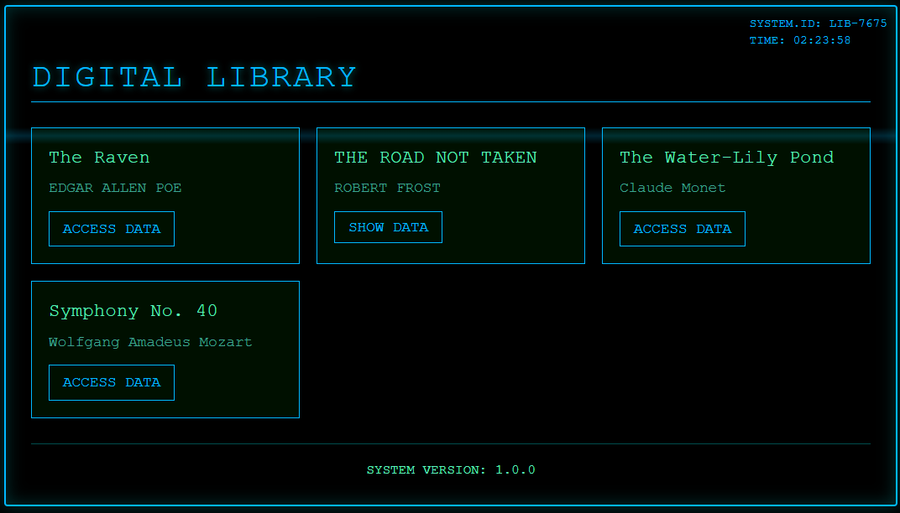

# Digital Library Captive Portal

This project is a digital library [captive portal](https://en.wikipedia.org/wiki/Captive_portal) using an ESP32 microcontroller. It sets up a WiFi access point and serves a web page with various digital content, including books, images, and audio.

NOTE: This implementation assumes the ESP32 does not have an SD card and is not partitioned. Therefore, all data is stored directly in the flash memory and served from there.



## Setup

### Hardware Requirements

- **ESP32**

### Software Requirements

- **Arduino IDE**: Download and install the [Arduino IDE](https://www.arduino.cc/en/software).

  - **ESP32 Board Package**: Install the ESP32 board package in the Arduino IDE. Follow the instructions [here](https://randomnerdtutorials.com/installing-the-esp32-board-in-arduino-ide-windows-instructions/).

  - Install the following libraries in the Arduino IDE:
    - `AsyncTCP`
    - `DNSServer`
    - `ESPAsyncWebServer`
    - `esp_wifi`

### Configuration

1. **Set WiFi Credentials**:

   - Open `main.ino` and set your SSID and password:
     ```ino
     const char *ssid = "your_ssid";
     const char *password = "your_password";
     ```

2. **Upload the Sketch**:
   - Connect your ESP32 to your computer using a USB cable.
   - Select the correct board and port in the Arduino IDE.
   - Upload to your ESP32.

## Usage

1. **Connect to the WiFi**:

   - Connect to the WiFi network with the SSID you configured.

2. **Access the Captive Portal**:

   - The captive portal should automatically open
   - If not, open a web browser and navigate to the IP address `http://4.3.2.1`.

3. **Browse the Digital Library**:
   - The main page will display a grid of available stories. Click on a story to view its content. There are 4 unique examples shown:
     1. Long Text
     2. Short Text (shown on the same page instead of linking to /book).
     3. Images
     4. Audio

## Project Structure

Each "story" is a record in the library. Every record is stored in an individual file and encoded in base64 format. Since our drive is not partitioned, we cannot use external files directly.

### Files

Main

- **main.ino**: The main Arduino sketch that sets up the WiFi access point, DNS server, and web server.
- **html_content.h**: Contains the main HTML content for the digital library.
- **book_page.h**: Contains the HTML template for the book page. The endpoint for this file is located at "/book?id=${story.id}"
- **stories.h**: Contains the JSON data for the stories.

Content

- **monet.h**: Contains the data for the Monet image.
- **mozart.h**: Contains the data for the Mozart song.
- **raven.h**: Contains the data for the Raven book.

## Limitations

### No SD Card Support

The ESP32 does not have an SD card interface in this configuration. Therefore, content such as books, images, and audio files need to be embedded in the firmware. This introduces the following limitations:

1.  Limited Storage:

    - The ESP32 has limited flash storage (around 4MB for most boards). Therefore, the size of the files you can serve is limited by the available space in the ESP32's flash memory.

2.  File Size Constraints:

    - Due to the limited flash storage, files like images and audio are typically stored as base64-encoded data within the code. This encoding typically increases the file size, meaning that file size limits are further reduced. Each file has a limit to the size, this is often significantly lower than the total flash storage on the device.

3.  Performance:

    - The ESP32 is powerful for its size but can still struggle with larger file sizes, especially if it's trying to serve multiple large files at once. Expect slower performance when loading large files, particularly images and audio, as they need to be decoded in real-time from base64.
